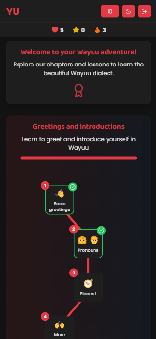

# YuApp - Keeping the Wayuu Language Alive


## 🌍 About YuApp
YuApp is an educational web application designed to preserve and promote the Wayuu language (Wayuunaiki) in an era of globalization and technology. Inspired by apps like Duolingo, it offers interactive lessons, quizzes, and structured content to help users learn and practice the language effectively.

## ✨ Features
- **Interactive Lessons**: Learn Wayuunaiki through structured and engaging lessons.
- **Quiz-Based Learning**: Different types of questions, including translations, matching pairs, and multiple-choice.
- **User Progress Tracking**: Save progress and track learning achievements.
- **Role-Based Access**: Secure authentication with JWT, admin views for content management.
- **Modern Tech Stack**: Backend in Django, frontend in React with NestJS.

## 📱View
- **Home**



## 🚀 Getting Started

### 1️⃣ Prerequisites
Ensure you have the following installed:
- Python 3.10+
- Node.js 18+
- Docker & Docker Compose
- PostgreSQL

### 2️⃣ Backend Setup (Django)
```bash
# Clone the repository
git clone https://github.com/yourusername/yuapp.git
cd yuapp/backend

# Set up a virtual environment
python -m venv venv
source venv/bin/activate  # On Windows, use 'venv\Scripts\activate'

# Install dependencies
pip install -r requirements.txt

# Set up environment variables
cp .env.example .env  # Update with your database credentials

# Run migrations
python manage.py migrate

# Start the backend server
python manage.py runserver
```

### 3️⃣ Frontend Setup (React + NestJS)
```bash
cd ../frontend

# Install dependencies
npm install

# Start the frontend
npm run dev
```

## 📡 API Endpoints (Example)
### User Registration
```http
POST /user/register/
```
```json
{
  "username": "new_user",
  "email": "user@example.com",
  "password": "securepassword"
}
```

### Authentication
```http
POST /user/login/
```
```json
{
  "username": "new_user",
  "password": "securepassword"
}
```

## 🤝 Contributing
We welcome contributions! To contribute:
1. Fork the repository.
2. Create a new branch (`git checkout -b feature-name`).
3. Commit your changes (`git commit -m 'Add feature'`).
4. Push to the branch (`git push origin feature-name`).
5. Create a pull request.

## 🛠 Tech Stack
- **Backend**: Django + PostgreSQL
- **Frontend**: React + NestJS
- **Authentication**: JWT
- **Deployment**: Docker

## 📜 License
This project is licensed under the MIT License.

---
**YuApp - Preserving a language, one lesson at a time.**

